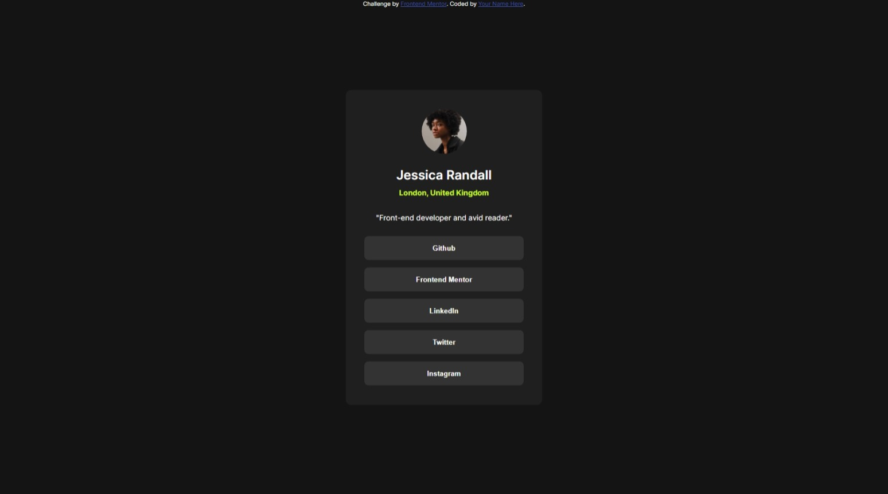

# Frontend Mentor - Social links profile solution

This is a solution to the [Social links profile challenge on Frontend Mentor](https://www.frontendmentor.io/challenges/social-links-profile-UG32l9m6dQ). Frontend Mentor challenges help you improve your coding skills by building realistic projects.

## Table of contents

- [Overview](#overview)
  - [The challenge](#the-challenge)
  - [Screenshot](#screenshot)
  - [Links](#links)
- [My process](#my-process)
  - [Built with](#built-with)
  - [What I learned](#what-i-learned)
  - [Continued development](#continued-development)
  - [Useful resources](#useful-resources)
- [Author](#author)
- [Acknowledgments](#acknowledgments)

## Overview

### The challenge

Users should be able to:

- See hover and focus states for all interactive elements on the page

### Screenshot



### Links

- Solution URL: [Github](https://github.com/Jumping-Saadman/social-links-profile-main)
- Live Site URL: [Github Pages](https://jumping-saadman.github.io/social-links-profile-main/)

## My process

### Built with

- Semantic HTML5 markup
- CSS custom properties
- CSS Grid
- Variable fonts
- CSS variables

### What I learned

I learnt how to add onclick property to button tags to hyper reference to a link:

```html
<button onclick="window.location.href = 'https://github.com/Jumping-Saadman'; ">
  Github
</button>
```

I also learned how to use variable fonts in CSS using @font-face:

```css
@font-face {
  font-family: "Inter";
  src: url("assets\fonts\Inter-VariableFont_slnt,wght.ttf") format("ttf-variations");
  src: url("assets\fonts\Inter-VariableFont_slnt,wght.ttf") format("ttf") tech(
      "variations"
    );
  font-weight: 400 600 700;
  font-stretch: 25% 151%;
}
```

I further learned how to use variables in the CSS file to reuse in :root :

```css
:root {
  --Green: hsl(75, 94%, 57%);
  --White: hsl(0, 0%, 100%);
  --Grey-700: hsl(0, 0%, 20%);
  --Grey-800: hsl(0, 0%, 12%);
  --Grey-900: hsl(0, 0%, 8%);
}
```

Then applying that variable later (an example):

```css
#location {
  color: var(--Green);
  margin: 10px auto 20px;
}
```

An approach of center aligning a container:

```css
.container {
  display: grid;
  position: absolute;
  top: 50%;
  left: 50%;
  width: 370px;
  /* height: 450px; */
  margin-right: -50%;
  transform: translate(-50%, -50%);
  grid-template-columns: 1fr;
  background-color: var(--Grey-800);
  border-radius: 10px;
}
```

### Continued development

- I may have to further use variable fonts, therefore I would like to learn more about them.
- I am struggling with positoning, alignment of divs. I may need to work further on them.
- I have not fully understood how to use font-strech so may need to work on that further.

### Useful resources

- [Web dev](https://web.dev/articles/variable-fonts) - This article helped me learn about variable fonts and how to use them. From now on, whenever I have the option to use variable fonts, I will try to use the methods taught here.
- [Geeks for Geeks](https://www.geeksforgeeks.org/how-to-create-an-html-button-that-acts-like-a-link/) - I didn't know how to add a link to a button, hence this article taught me a good way to do that. From here on, if I ever need to add links to a button, I may refer to the method learned here.
- [Stack Overflow](https://stackoverflow.com/questions/31217268/center-div-on-the-middle-of-screen) - I wanted to learn how to center-align a div, hence this Stack overflow Q/A thread helped me find the answer to that. Specifically the answer by [Nixen85](https://stackoverflow.com/users/8900664/nixen85) helped me find the modern and short version of the desired code.

## Author

- Website - [Jumping-Saadman](https://github.com/Jumping-Saadman)
- Frontend Mentor - [@Jumping-Saadman](https://www.frontendmentor.io/profile/@Jumping-Saadman)
- Twitter - [@SaadmanOmar](https://x.com/SaadmanOmar)

## Acknowledgments

- [Nixen85](https://stackoverflow.com/users/8900664/nixen85) answer on this [Stack Overflow post](https://stackoverflow.com/questions/31217268/center-div-on-the-middle-of-screen) by [carloss medranoo](https://stackoverflow.com/users/4797741/carloss-medranoo) helped me learn centering divs. Thanks to their contribution I was able to implement this idea in my project.
- This [Web dev](https://web.dev/articles/variable-fonts) article about variable fonts by Dave Crossland, Mustafa Kurtuldu, Roel Nieskens, and Thomas Steiner taught me about variable fonts. Thanks to them I was able to implement variable font in my project for the first time.
